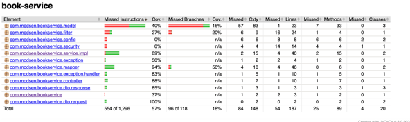
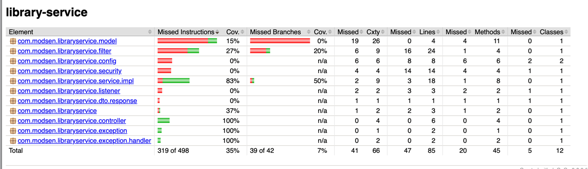

# API Системы Управления Библиотекой 📚

Этот проект представляет собой CRUD Web API для имитации системы библиотеки, разработанный с использованием Spring Boot.
Приложение состоит из 3 микросервисов:
- book-service(порт 8080) - сервис по предоставлению книг
- library-service(порт 8081) - сервис по предоставлению доступных книг в библиотеке
- auth-service(порт 8082) - хранение данных о пользователях, генерирация JwtToken.

## Функционал
- Получение всех книг: Получение списка всех книг(с помощью пагинации).
- Получение книги по ID: Получение информации о конкретной книге по её ID.
- Получение книги по ISBN: Получение информации о конкретной книге по её ISBN.
- Добавление новой книги: Создание новой записи о книге в библиотеке.
- Изменение информации о существующей книге: Модификация данных о существующей книге.
- Удаление книги: Удаление книги из библиотеки.
- Получение всех доступных книг: Получение списка всех доступных книг(с помощью пагинации).
- Взять книгу в библиотеке
- Вернуть книгу в библиотеку

## Используемые технологии
- Spring Boot
- Spring MVC
- Spring Data JPA
- Spring Security
- PostgreSQL
- Apache Kafka
- MapStruct
- Lombok
- OpenApi
- Docker

## Инструкция по запуску проекта
1. Склонируйте репозиторий на свой компьютер 💻
  ```bash
  git clone https://github.com/LyeshaKorotkevich/library-web-api.git
  ```
2. Установка и запуск
* Для Linux/Mac 🍎:
  ```bash
  ./run.sh
  ```
* Для Windows 🪟:
  ```bash
  run.bat
  ```
3. Тестирование API  
  В проекте есть коллекция Postman с примерами запросов для всех доступных конечных точек API, которая находится в директории postman.
  Вы можете импортировать коллекцию в Postman для удобного тестирования API.

4. Документация API  
   Эндпоинты API задокументированы с помощью Swagger. После запуска приложения вы можете получить доступ к документации по адресу:  
   http://localhost:8080/swagger - book-service
   http://localhost:8081/swagger - library-service
   http://localhost:8082/swagger - auth-service

## Покрытие тестами

### book-service


### library-service


### auth-service